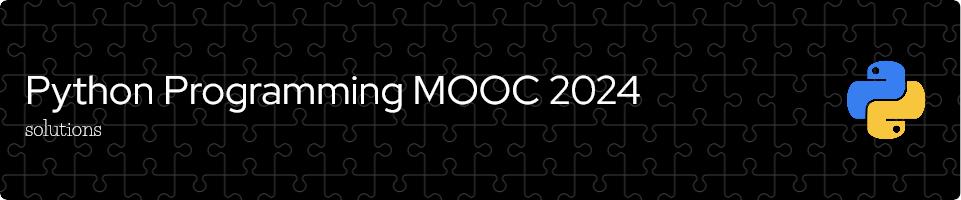

Solutions for _Introduction to Programming_ course (BSCS1001, 5 cr) and the _Advanced Course in Programming_ (BSCS1002, 5 cr) from the Department of Computer Science at the **University of Helsinki**. You can join here: https://programming-24.mooc.fi/.

Just a heads up that these solutions are my approach to the exercises. There might be other ways that are shorter, more efficient, or have a cleaner code style. Feel free to get inspired.
